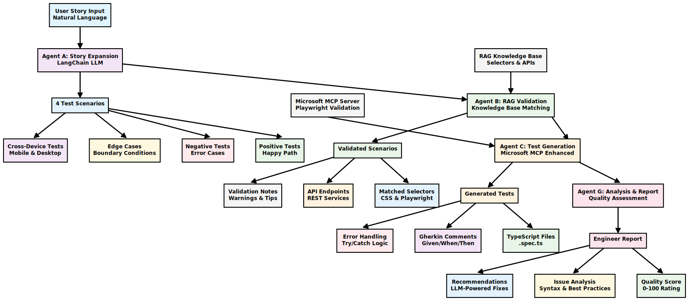

# AI-Powered Playwright Test Generator for Experian

An intelligent test generation framework that transforms natural language user stories into production-ready Playwright tests for **Experian.com** using **LangChain**, **RAG (Retrieval-Augmented Generation)**, and **multi-agent AI design**.

## Table of Contents
- [How It Works](#how-it-works)
- [Quick Start](#quick-start)
- [Example Usage](#example-usage)
- [Architecture](#architecture)
- [Configuration](#configuration)
- [Commands](#commands)
- [Project Structure](#project-structure)
- [Troubleshooting](#troubleshooting)

## How It Works

This framework uses a sophisticated AI pipeline to automatically generate comprehensive test suites:

<div align="center">
  
  <br />
  <em>Complete AI Pipeline Flow - From User Story to Production-Ready Tests</em>
</div>

### What Each Agent Does:

1. **Agent A (Story Expansion)**: Takes your user story and creates 4 different test scenarios
2. **Agent B (RAG Validation)**: Matches scenarios with real Experian selectors and APIs
3. **Agent C (Test Generation)**: Creates actual Playwright test files with Microsoft MCP validation
4. **Agent G (Analysis)**: Reviews generated tests and provides quality reports

## Quick Start

### Step 1: Install Dependencies
```bash
npm install
```

### Step 2: Set Up Your AI Provider
Create a `.env` file with your preferred AI provider:

**OpenAI (Recommended)**
```bash
LLM_PROVIDER=openai
OPENAI_API_KEY=your_openai_api_key_here
```


### Step 3: Generate Your First Test
```bash
npm run generate-tests "User navigates to Experian homepage and clicks on Credit dropdown"
```

### Step 4: Run the Generated Test
```bash
npm run test
```

That's it! Your AI-generated test will run in headed mode so you can see what's happening.

## Example Usage

### Input: Simple User Story
```bash
npm run generate-tests "User signs in to their Experian account"
```

### Output: What Gets Generated

**Files Created:**
```
tests/generated/
├── successful-user-sign-in-desktop.spec.ts
├── invalid-password-error-desktop.spec.ts
├── account-lockout-after-failed-attempts-desktop.spec.ts
├── mobile-responsive-sign-in-mobile.spec.ts
└── generation-report.json
```


**Quality Report Generated:**
```
Engineer Review Report:
- Quality Score: 95/100
- Ready to Run: 4/4 tests
- Issues Found: 2 minor warnings
- Recommendations: Use more specific selectors for better reliability
```

## Architecture

### Core Technologies
- **LangChain**: Multi-provider LLM integration with structured prompts
- **RAG (Retrieval-Augmented Generation)**: Knowledge base of Experian selectors and APIs
- **Microsoft MCP**: Real-time Playwright API validation
- **TypeScript**: Type-safe test generation
- **Playwright**: Cross-browser test execution

### Multi-Agent Pipeline

| Agent | Purpose | Input | Output |
|-------|---------|-------|--------|
| **Agent A** | Expand user stories | Natural language | 4 test scenarios |
| **Agent B** | Validate with RAG | Test scenarios | Scenarios + selectors |
| **Agent C** | Generate tests | Validated scenarios | TypeScript test files |
| **Agent G** | Analyze quality | Generated tests | Quality report |

### Knowledge Base (RAG)
The framework includes Experian-specific knowledge:
- **UI Selectors** (`kb/selectors/common.json`): Navigation, forms, buttons
- **API Endpoints** (`kb/apis/endpoints.json`): Authentication, credit services

## Configuration

### Environment Variables
```bash
# Required: Choose your LLM provider
LLM_PROVIDER=openai  # or anthropic, ollama

# OpenAI Setup
OPENAI_API_KEY=your_key_here
OPENAI_MODEL=gpt-4-turbo-preview

# Framework Settings
MAX_RETRIES=3
USE_MCP_AGENT=true
LOG_LEVEL=info
```

### Playwright Configuration
The framework is pre-configured for:
- **Headed Mode**: Always runs with visible browser
- **Visual Debugging**: Element highlighting and screenshots
- **Cross-Browser**: Tests on Chromium, Firefox, and WebKit
- **Experian Focus**: Optimized for Experian.com testing

## Commands

| Command | What It Does | When To Use |
|---------|--------------|-------------|
| `npm run generate-tests "story"` | Generate AI-powered tests | When you have a new user story |
| `npm run test` | Run all tests (headed mode) | To execute your generated tests |
| `npm run validate-selectors-live` | Check selectors on live site | When selectors might be outdated |
| `npx playwright test --ui` | Run with Playwright UI | For interactive debugging |

### Example Commands
```bash
# Generate tests for different scenarios
npm run generate-tests "User checks their credit score"
npm run generate-tests "User signs up for credit monitoring"
npm run generate-tests "User updates their profile information"

# Run specific test
npx playwright test tests/generated/your-test.spec.ts --headed
```

## Project Structure

```
experian/
├── 📁 src/
│   ├── 📁 agents/              # AI agents
│   │   ├── langchain-agent-a.ts   # Story expansion
│   │   ├── langchain-agent-b.ts   # RAG validation  
│   │   ├── mcp-enhanced-agent-c.ts # Test generation
│   │   └── analysis-agent-g.ts    # Quality analysis
│   ├── 📁 llm/                 # LangChain integration
│   ├── 📁 mcp/                 # Microsoft MCP client
│   ├── 📁 pages/               # Page Object Model
│   └── 📁 utils/               # Helper functions
├── 📁 kb/                      # Knowledge Base (RAG)
│   ├── 📁 selectors/           # UI selectors
│   └── 📁 apis/                # API endpoints
├── 📁 tests/generated/         # AI-generated tests
├── 📁 scripts/                 # Utility scripts
└── 📁 reports/                 # Quality reports
```

## Features

### What Makes This Framework Special

**1. Intelligent Test Generation**
- Converts plain English to working Playwright tests
- Generates multiple test scenarios automatically
- Includes error handling and edge cases

**2. Experian-Specific Knowledge**
- Pre-built selector library for Experian.com
- API endpoint mapping for common services
- Validation against live website

**3. Quality Assurance**
- Real-time syntax validation with Microsoft MCP
- Comprehensive quality scoring (0-100)
- Best practices enforcement

**4. Visual Debugging**
- Element highlighting during test execution
- Step-by-step screenshots
- Headed mode by default for visibility

**5. Multi-LLM Support**
- OpenAI GPT-4 (best quality)
- Anthropic Claude (high quality alternative)
- Ollama (free local models)

## Troubleshooting

### Common Issues and Solutions

**Problem: "No API key found"**
```bash
# Solution: Check your .env file
LLM_PROVIDER=openai
OPENAI_API_KEY=your_actual_api_key_here
```

**Problem: "Selector not found"**
```bash
# Solution: Validate selectors against live site
npm run validate-selectors-live
# Then update kb/selectors/common.json with working selectors
```

**Problem: "Test generation failed"**
- Check your internet connection
- Verify your API key is valid
- Try a simpler user story first

**Problem: "Tests won't run"**
```bash
# Solution: Install Playwright browsers
npx playwright install
```

### Getting Help

1. **Check the generated reports** in the `reports/` folder
2. **Review the quality score** - aim for 80+ for production
3. **Look at the engineer recommendations** in the analysis report
4. **Validate selectors** if tests fail on element interactions

## Advanced Usage

### Custom Selectors
Add your own selectors to `kb/selectors/common.json`:
```json
{
  "my_section": {
    "my_button": "button[data-testid='my-button']",
    "my_input": "input[name='my-field']"
  }
}
```

### Custom User Stories
The framework works best with specific, actionable user stories:

**Good Examples:**
- "User navigates to Credit dropdown and clicks Free Credit Report"
- "User signs in with valid credentials and views dashboard"
- "User fills out signup form and receives confirmation email"

**Avoid:**
- "User uses the website" (too vague)
- "Test all functionality" (too broad)

## Contributing

Want to improve the framework?

1. **Add new selectors**: Update `kb/selectors/common.json`
2. **Improve prompts**: Edit `src/llm/prompt-templates.ts`
3. **Add new agents**: Create new files in `src/agents/`
4. **Extend knowledge base**: Add to `kb/apis/endpoints.json`

## License

MIT License - Use this framework for your own projects!

---

**Questions?** Check the `reports/` folder after running tests - it contains detailed analysis and recommendations for improving your tests.